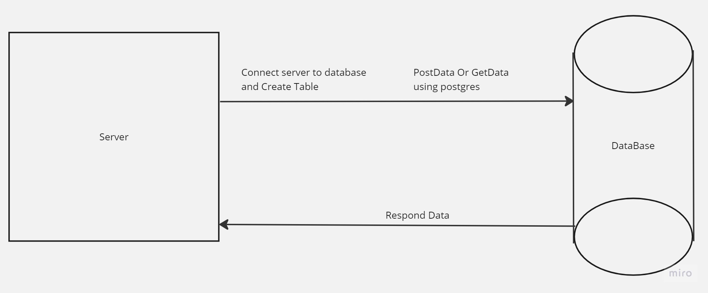

# Movies-Library - v18.15.0

**Author Name**: *Hamza Altamary*

## WRRC

## Overview

## Getting Started

- Deal with sql and postgress

-  send and get data from database

- deploy our server using Render.com

- create database table

## Project Features

- Deal with database

- Handel 404 Error and 500 Error 

- Functionality 

-
